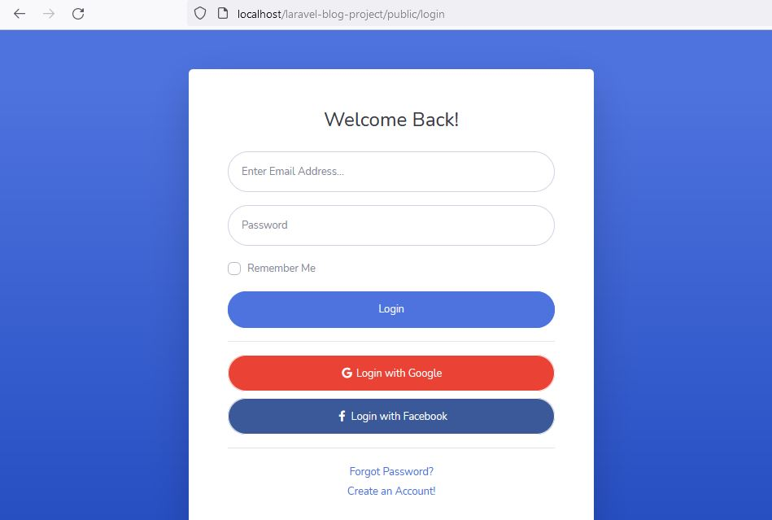
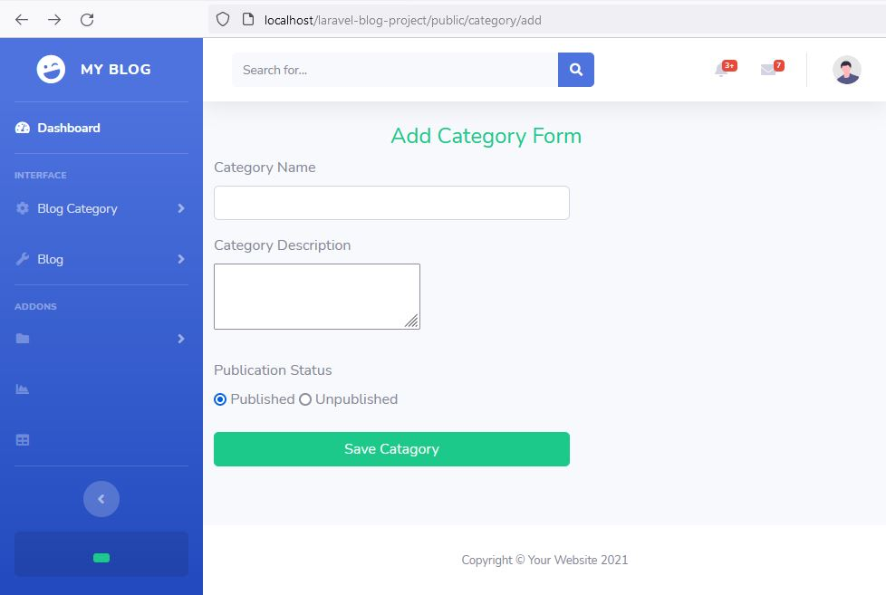
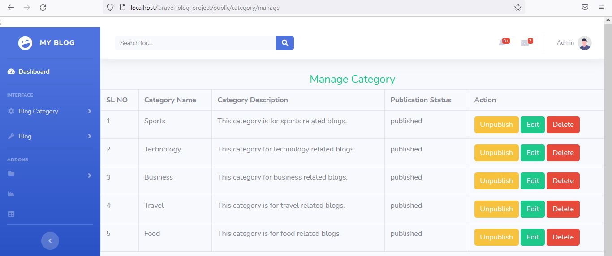
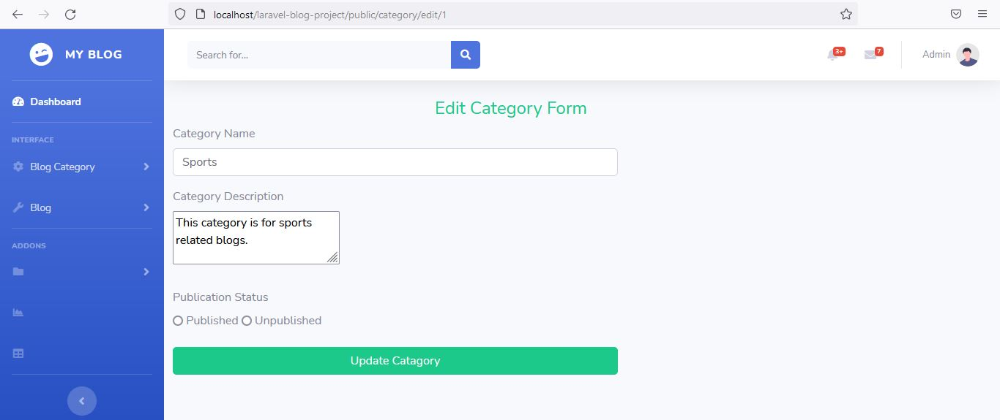
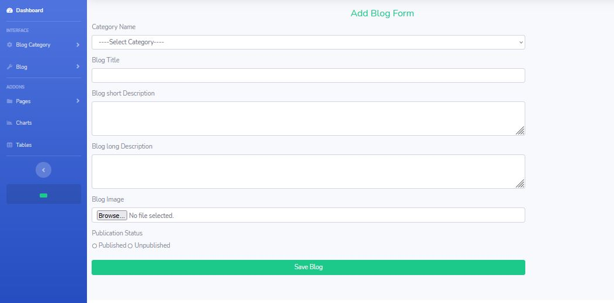
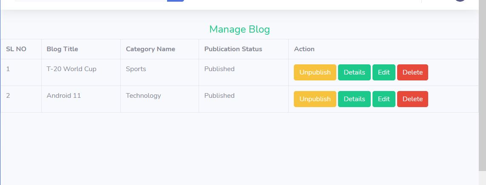
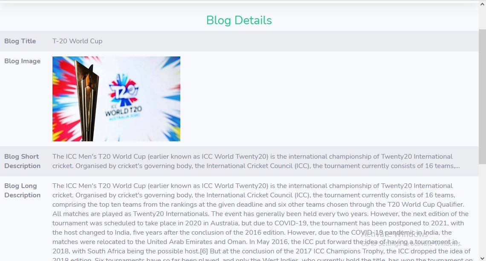
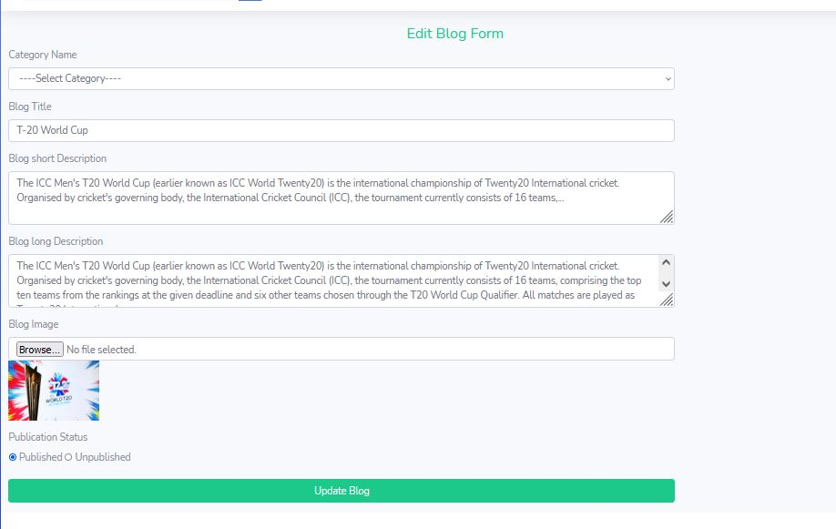

<h3>laravel-blog-project</h3>

This is a blog project using PHP Laravel framework. Features of this project is add blog category, edit category, publish/unpublish category, delete category, add new blog, show blog details, edit blog, publish/unpublish blog, delete blog.

Project Screenshots:

<h3>Admin Login:</h3>

<h3>Add Blog Category</h3>

<h3>Manage Category</h3>

<h3>Edit Category</h3>

<h3>Add New Blog</h3>

<h3>Manage Blog </h3>

<h3>Show Blog Details</h3>

<h3>Edig Blog</h3>

